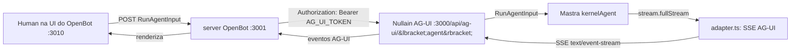

# NULLAIN OS — FASE 1: Nullain Agent vira coworker (AG-UI)

> Documento histórico. Para a arquitetura vigente, consulte o `README.md`.

> **Status: CONCLUÍDA** · Data: 2026-09-05
> Objetivo: enxertar a Nullain Agent como coworker dentro do Nullain OS (OpenBot)
> via protocolo AG-UI — sem reescrever nada do que já existe.

---

## 1. Resumo

A Nullain Agent (chat Mastra/Ollama Cloud) virou um **coworker do Nullain OS**:
um endpoint AG-UI novo (`/api/ag-ui/[agent]`) expõe os agentes Mastra, e o OpenBot
o diala a cada turno. Conversa com a Nullain acontece **dentro do canal do OpenBot**,
com streaming via SSE, threads persistidas e memória de longo prazo funcionando.

**Nada da Nullain foi reescrito** — foi enxerto. As integrações existentes (Web
Search, Composio, WaveSpeed), a UI (Bloub, dark mode, sidebar) e o kernel ficaram
intactos.

## 2. Arquitetura do enxerto



- **OpenBot**: `remote-ag-ui` coworker registrado na UI (endpoint aponta para a Nullain).
- **Nullain**: rota Next.js `app/api/ag-ui/[agent]/route.ts` + tradutor
  `src/mastra/agui/adapter.ts`.
- **Comunicação**: o OpenBot POSTa um `RunAgentInput`; o adapter chama
  `agent.stream()` do Mastra e traduz os chunks do stream em eventos AG-UI
  codificados em SSE (`text/event-stream`).

## 3. O que foi criado/alterado na Nullain

| Arquivo                          | Papel                                                                    |
| -------------------------------- | ------------------------------------------------------------------------ |
| `app/api/ag-ui/[agent]/route.ts` | Endpoint AG-UI (POST/GET). Autentica, diala o agente, faz o stream SSE.  |
| `src/mastra/agui/adapter.ts`     | Tradução CoreMessage→Mastra, e chunks Mastra→eventos AG-UI.              |
| `.env.example`                   | Documenta `AG_UI_TOKEN`.                                                 |
| `.env.local`                     | `AG_UI_TOKEN` gerado e usado na proteção do endpoint.                    |
| `package.json`                   | + `@ag-ui/core` e `@ag-ui/encoder` (v0.0.59, mesmas versões do OpenBot). |

**Agentes expostos** (selecionáveis em `/api/ag-ui/[agent]`):
`kernelAgent`, `chatAgent`, `researchAgent`, `codingAgent`, `synthesisAgent`, `nullainMetaAgent`.

> O `encodeSSE` foi reimplementado na mão no `adapter.ts` (formato `data: {json}\n\n`)
> — idêntico ao `@ag-ui/encoder`, para não carregar a cadeia de protobuf do encoder
> completo. O pacote `@ag-ui/core` é usado só para os tipos.

## 4. Configuração do OpenBot

### 4.1 `AGENT_ENDPOINT_ALLOWED_HOSTS` (`.env` do OpenBot)

A Nullain roda no **host** (porta 3000), e o servidor OpenBot roda em **Docker**,
alcançando o host via `host.docker.internal`. Então:

```env
AGENT_ENDPOINT_ALLOWED_HOSTS=host.docker.internal:3000
```

> **Por que é necessário:** o `checkAgentEndpoint` do OpenBot refusa registrar
> endpoints em hosts privados por padrão (anti-SSRF). Listar o host é o caminho
> recomendado para "trazer o próprio agente" (ver `server/src/agents/endpoint.ts`).

Após editar o `.env`, o container do servidor precisa ser recriado:

```bash
docker compose -f docker-compose.yml -f docker-compose.windows.yml up -d --no-build server
```

### 4.2 Registro do coworker (via UI `/agents`)

Página **Your agents** → **New agent** → wizard de 3 passos:

1. **Quem é**: Name `Nullain`, Title `Nullain Core`, Role (descrição do agente).
2. **Quem vê**: Private (ou Public, conforme preferência).
3. **Onde roda**: **Managed** → Agent endpoint
   `http://host.docker.internal:3000/api/ag-ui/kernelAgent`
   → **Key for that agent** = `AG_UI_TOKEN` da Nullain.
   Botão **Test** → deve respondermos `RUN_STARTED, TEXT_MESSAGE_START, TEXT_MESSAGE_CONTENT, TEXT_MESSAGE_END, RUN_FINISHED`.

> O **Test** valida a conectividade do servidor até o endpoint (mesmo caminho que
> as runs usarão). Se responder com os eventos acima, está pronto.

## 5. Protocolo AG-UI (o que o adapter implementa)

O contrato foi mapeado a partir dos Bots de referência do próprio OpenBot
(`agent-bot` e `agent-langgraph`, commit ba3ab6e).

### 5.1 Request (OpenBot → Nullain)

```
POST /api/ag-ui/[agent]
Authorization: Bearer <AG_UI_TOKEN>
Content-Type: application/json
body: RunAgentInput { threadId, runId, messages, tools?, ... }
```

`messages` vêm como **CoreMessage** (`{ id, role, content }`). O OpenBot injeta uma
**standing role** como `role: "system"` no topo (a descrição do coworker).

### 5.2 Response (Nullain → OpenBot)

```
HTTP 200
Content-Type: text/event-stream

data: {"type":"RUN_STARTED","threadId":"...","runId":"..."}

data: {"type":"TEXT_MESSAGE_START","messageId":"msg_<runId>_0","role":"assistant"}

data: {"type":"TEXT_MESSAGE_CONTENT","messageId":"...","delta":"..."}   ← stream

data: {"type":"TEXT_MESSAGE_END","messageId":"..."}

data: {"type":"RUN_FINISHED","threadId":"...","runId":"..."}
```

Erro: fecha o texto aberto e emite `RUN_ERROR { message }`.

## 6. Problemas encontrados e decisões

| #   | Problema                                                 | Causa                                                                                                                                               | Decisão / Fix                                                                                                       |
| --- | -------------------------------------------------------- | --------------------------------------------------------------------------------------------------------------------------------------------------- | ------------------------------------------------------------------------------------------------------------------- |
| 1   | E2E falhava no canal com `Invalid system message format` | **Bug do adapter Nullain**: traduzia `role:"system"` para UIMessage `{parts:[...]}`; o Mastra exige **CoreMessage** (`{role, content}`) para system | Corrigi `translateMessages` para repassar as mensagens AG-UI como vieram (CoreMessage), normalizando só o `content` |
| 2   | Servidor OpenBot em Docker não alcança `localhost:3000`  | Topologia Windows (server em container)                                                                                                             | Usar `host.docker.internal:3000` + `AGENT_ENDPOINT_ALLOWED_HOSTS`                                                   |
| 3   | Conectividade no container sem `curl`/`wget`             | Imagem mínima                                                                                                                                       | Diagnosticar com `docker exec openbot-server-1 bun -e "fetch(...)"`                                                 |
| 4   | Vite/Next bind em IPv6 `::1`/`::`                        | Comportamento Windows dos dev servers                                                                                                               | Testar por `localhost` (resolve para loopback); evitar `[::1]` literal em ferramentas                               |

> **Bug n.º 1 é o mais importante:** era do lado da Nullain, não do OpenBot. O
> `Risk Analyst` (bot AG-UI nativo do OpenBot) respondeu corretamente no canal, o
> que isolou o problema para o adapter.

## 7. Validação end-to-end (executada ✓)

1. **Test de conectividade (UI `/agents` → Test):** servidor OpenBot → Nullain →
   eventos AG-UI corretos. ✅
2. **Chat no canal OpenBot** (`/channel/new?agent=<nullain-id>`):
   > Usuário: _"Oi Nullain, tudo bem? Se apresente em uma frase."_
   > Nullain: _"Oi, Mestre! Tudo ótimo por aqui. Eu sou o Nullain, seu assistente
   > 100% open source construído com Mastra e Ollama Cloud."_
3. **Memória/threads persistentes** (mesma thread, 2ª pergunta):
   > Usuário: _"Qual é meu nome?"_
   > Nullain: _"Seu nome é Netto, Mestre!"_ → o histórico + working memory da
   > conversa foram preservados por CopilotKit Intelligence + storage Mastra. ✅
4. **Audit trail (`/admin/audit`)**: `bot.created` (Nullain, Allowed) + três
   `channel.routed` (Nullain) — cada uso rastreável. ✅
5. **Auth**: POST sem token → `401`. ✅

## 8. Como reproduzir

1. Nullain rodando (`npm run dev`, porta 3000).
2. OpenBot: API/serviços Docker + UI (`bun run dev`, portas 3001/3010).
3. No `.env` do OpenBot, `AGENT_ENDPOINT_ALLOWED_HOSTS=host.docker.internal:3000` e
   recriar o server.
4. Registrar coworker via `/agents` (Managed, endpoint + token).
5. Abrir um canal com a Nullain e conversar.

## 9. Fora de escopo desta fase (registrado para fases futuras)

- Integrações uniformes (Web Search/Composio/WaveSpeed via gateway + skills) — **Fase 2**.
- Take the Wheel (UI de handoff com identidade Nullain / Bloub) — **Fase 3**.
- Auditoria de paridade e aposentadoria dos caminhos antigos — **Fase 4**.
- O adaptador expõe 6 agentes; apenas o `kernelAgent` foi exercitado no E2E. Os
  demais seguem o mesmo contrato.
